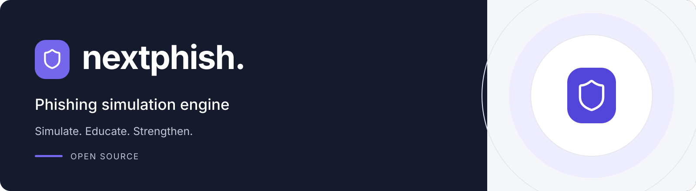

# NextPhish

NextPhish is an open-source phishing simulation engine built with Next.js. It lets companies run internal phishing campaigns against their own employees to assess security awareness, replacing legacy tools like GoPhish.

## Why NextPhish?

GoPhish is no longer maintained and suffers from persistent issues — buggy template management, no proper API, difficult multi-user workflows. NextPhish is built from the ground up with a modern stack:

- **Type-safe end to end** — tRPC ensures your API contracts are never out of sync
- **Developer-friendly** — full TypeScript, DDD modules, dependency injection
- **Queue-driven campaigns** — BullMQ handles scheduling, delivery, and event tracking at scale
- **Multi-tenant ready** — BetterAuth + Prisma make per-organisation isolation straightforward
- **Lightweight landing pages** — Hono serves phishing page HTML directly from the database on a separate port, keeping the main app secure

Check `docs/architecture.md` for the full stack and structure.

## Getting Started

Start with the [local development guide](docs/setup.md). It covers Node.js 24, pnpm 10.33.4, environment variables, database migrations, `pnpm dev:up`, Storybook, local email testing, and troubleshooting.

`pnpm dev:up` starts PostgreSQL, Redis and the SMTP capture service in Docker, then runs the web app, public content server and worker on your host. It does not install dependencies or apply migrations. Follow the first-run setup before using it.

## Deployment

See the [deployment guide](docs/deployment.md) for service topology, production configuration, build and migration steps, service lifecycle, HTTPS reverse proxying, backups, upgrades and rollback.

The checked-in Compose file targets development. The guide documents production images with a standalone Next.js app and compiled worker/content processes.

## Documentation

- **Documentation website:** run `pnpm --filter @next-phish/docs dev` and open <http://localhost:4321>. The Astro site contains the getting started guide, local and production setup, and app feature guides. Build its static output with `pnpm --filter @next-phish/docs build` (`apps/docs/dist/`). The website is deployed separately from the management app and the production Compose stack.
- [Local development](docs/setup.md)
- [Deployment and operations](docs/deployment.md)
- [Architecture](docs/architecture.md)
- [Coding standards](docs/coding-standards.md)
- [Contributing and branching strategy](contribution.md)
- [UI component library and Storybook](packages/ui/README.md)
- [System email templates (MJML)](packages/backend/src/email/templates/README.md)

## MCP Server

NextPhish includes an MCP (Model Context Protocol) server that lets compatible AI assistants interact with your instance. See the [MCP setup guide](apps/docs/src/content/docs/guides/mcp.md) for connection steps, permissions, and the current tool inventory.

## License

MIT
