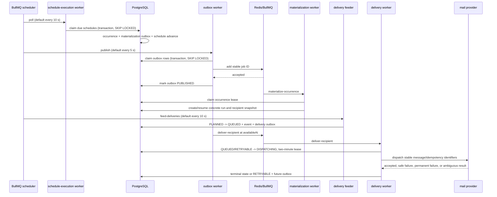

# Scheduling and delivery internals

This document describes the implemented scheduling and email-delivery pipeline. It is an engineering reference for changing the worker, persistence model, queue contracts, or failure handling. The public explanation is intentionally simpler; this document names transaction boundaries and known failure windows.

For environment variables, health metrics, diagnostic SQL and incident recovery, see the [delivery operations runbook](delivery-operations.md).

## Components and durable records

PostgreSQL is the system of record. Redis/BullMQ transports work between processes. The worker process owns the periodic schedulers and queue consumers.

The principal records are defined in [`schema.prisma`](../packages/database/prisma/schema.prisma):

| Record                              | Role                                                                 | Relevant guards                                                                                                  |
| ----------------------------------- | -------------------------------------------------------------------- | ---------------------------------------------------------------------------------------------------------------- |
| `schedule`                          | Recurrence, timezone, source selection, pacing, and next due instant | Index on `(status, executionEnabled, nextOccurrenceAt)`; `revision` is copied to occurrences                     |
| `schedule_source`                   | Ordered reusable campaign sources                                    | Unique `(scheduleId, position)`                                                                                  |
| `schedule_occurrence`               | One selected source at one due instant                               | Unique `(scheduleId, occurrenceAt)`; `campaignId` unique; status, lease, attempts, and materialization cursor    |
| `campaign`                          | Concrete run and its shadow resources                                | Unique `(scheduleId, occurrenceAt)` prevents a second run for one occurrence                                     |
| `campaign_recipient`                | Per-recipient pacing and delivery state                              | Unique tracking ref, message ID, idempotency key, and `(campaignId, normalizedEmail)`; lease and attempt counter |
| `delivery_attempt`                  | One provider-dispatch attempt                                        | Unique `(campaignRecipientId, attemptNumber)`                                                                    |
| `campaign_event` / `delivery_event` | Product and transport timelines                                      | Unique `deduplicationKey`; provider delivery-event ID is also unique                                             |
| `outbox_event`                      | Durable intent to enqueue work                                       | Unique `deduplicationKey`; availability time, publish state, claim, attempts, and last error                     |

The implementation entry points are:

- [`ScheduleExecutionRepository`](../packages/backend/src/delivery/repositories/schedule-execution.repository.ts)
- [`CampaignRepository.materializeClaimedOccurrence`](../packages/backend/src/campaign/repositories/campaign.repository.ts)
- [`DeliveryRepository`](../packages/backend/src/delivery/repositories/delivery.repository.ts)
- [`OutboxRepository`](../packages/backend/src/delivery/repositories/outbox.repository.ts)
- [`DeliveryProcessorService`](../packages/backend/src/delivery/services/delivery-processor.service.ts)
- [worker registration and schedulers](../apps/worker/src/index.ts)
- [versioned queue payload schemas](../packages/shared/src/schemas/execution.schema.ts)

## End-to-end sequence



Arrows to the database do not all represent one transaction. The exact boundaries are described below.

## Schedule polling, recurrence, and claiming

The worker registers a BullMQ job scheduler named `schedule-poller`. Its default interval is `SCHEDULE_POLL_INTERVAL_MS=10000`. The `schedule-execution` worker has concurrency 1, but correctness does not depend only on that process-level setting.

`claimDueSchedules()` runs one PostgreSQL transaction. It selects at most `SCHEDULE_CLAIM_BATCH` rows (default 50, clamped to 1–200) that are `SCHEDULED` or `RUNNING`, have execution enabled, and have `nextOccurrenceAt <= now`. Selection orders by `nextOccurrenceAt` and uses `FOR UPDATE SKIP LOCKED`.

For each locked schedule, the same transaction:

1. loads its ordered sources;
2. calculates the due `occurrenceAt` and next future instant;
3. selects a source using the configured deck/random strategy;
4. upserts `schedule_occurrence` by `(scheduleId, occurrenceAt)`;
5. upserts an outbox row keyed `occurrence:<occurrenceId>:materialize`; and
6. advances or completes the schedule.

Recurrence uses [`nextOccurrenceAfter`](../packages/backend/src/delivery/services/recurrence.service.ts) with the schedule timezone and local-time fields. For an overdue recurring schedule, the loop advances through due instants but retains only the latest due instant. It is bounded at 1,000 calculations; exceeding that bound throws and rolls back the transaction. This is the implemented catch-up policy, not a replay of every missed occurrence.

A schedule becomes terminal after a one-time occurrence, the configured maximum campaign count, the end date, or source-deck exhaustion. Because occurrence creation, outbox insertion, and schedule advancement share the transaction, none of those three durable changes can commit alone.

## Outbox publication

The outbox bridges a PostgreSQL commit to a Redis operation; it is not a distributed transaction.

The `outbox-publisher` scheduler runs every `OUTBOX_POLL_INTERVAL_MS` (default 5 seconds). `claimBatch(workerId, 100)` performs a transaction that:

1. selects available `PENDING`, `FAILED`, or stale `PUBLISHING` rows;
2. orders by `availableAt`, then `createdAt`;
3. locks them with `FOR UPDATE SKIP LOCKED`;
4. treats a `claimedAt` older than five minutes as reclaimable; and
5. marks the selected rows `PUBLISHING`, records the worker and claim time, and increments `attempts`.

The Redis publish and database acknowledgement are necessarily separate operations. The worker derives the BullMQ `jobId` from the outbox deduplication key through `stableJobId()`. After `Queue.add()` resolves, it conditionally changes the row from `PUBLISHING` to `PUBLISHED` for the same claimant. A publish exception changes it to `FAILED`, records a truncated error, and moves `availableAt` 30 seconds forward.

### Topic and job mapping

| Outbox topic      | BullMQ queue      | Job name                 | Version 1 payload                     | Producer                                                                                                        |
| ----------------- | ----------------- | ------------------------ | ------------------------------------- | --------------------------------------------------------------------------------------------------------------- |
| `materialization` | `materialization` | `materialize-occurrence` | `{ version: 1, occurrenceId }`        | Due-schedule transaction                                                                                        |
| `delivery-feeder` | `delivery-feeder` | `feed-deliveries`        | `{ version: 1, wakeId }`              | Available for durable feeder wakes; the current periodic feeder is scheduled directly                           |
| `delivery`        | `delivery`        | `deliver-recipient`      | `{ version: 1, campaignRecipientId }` | Feeder transaction and retry transition                                                                         |
| `delivery-events` | `delivery-events` | `process-delivery-event` | `{ version: 1, deliveryEventId }`     | Provider-event ingestion path; current worker handler deliberately throws because integration is not configured |
| `tracking-events` | `tracking-events` | `process-tracking-event` | `{ version: 1, trackingEventId }`     | Tracking inbox transaction                                                                                      |

Implemented materialization, feeder, delivery and tracking handlers validate their payloads with strict Zod schemas before using IDs. The delivery-events placeholder throws without processing its payload. The job defaults are five BullMQ attempts, exponential backoff starting at five seconds, completed-job retention of 5,000 or one day, and failed-job retention of 10,000 or seven days.

## Materialization and snapshot consistency

The materialization consumer first claims a `PENDING` or `FAILED` occurrence, changes it to `MATERIALIZING`, increments its attempt count, and creates a five-minute lease. A completed occurrence with a campaign is returned without recreating work; a concurrently held occurrence is ignored.

`materializeOccurrence()` validates that the schedule still owns the selected source and that the catalog email template, landing page, sending profile, and target group remain eligible. Its initial transaction uses the unique `(scheduleId, occurrenceAt)` campaign key as an idempotency boundary. It creates a concrete `SCHEDULED` campaign and shadow copies of the selected resources, including attachment references. The run records `sourceCampaignId`, `scheduleId`, `occurrenceAt`, timezone, pacing-derived configuration, and automatic-completion configuration.

Recipient materialization is intentionally resumable rather than one large transaction. It reads source target-group users in ID order, in batches controlled by `MATERIALIZATION_BATCH_SIZE` (default 250, clamped to 1–1,000). Each batch transaction:

- copies target-group users into the run's shadow group with `skipDuplicates`;
- creates recipient rows guarded by `(campaignId, normalizedEmail)`;
- allocates unique tracking reference, message ID, and idempotency key;
- computes `scheduledAt` deterministically from `occurrenceAt`, stable recipient index, and delivery mode;
- upserts the recipient `SCHEDULED` campaign event; and
- advances the occurrence cursor, materialized count, and lease.

Blast assigns the occurrence time. Drip spaces recipients from the configured emails-per-minute rate. Batch groups `batchSize` recipients and offsets groups by `batchIntervalMinutes`; see [`calculateScheduledAt`](../packages/backend/src/delivery/services/pacing.service.ts).

After the final batch, a transaction compares campaign-recipient count with shadow-target-group count. Only a matching snapshot marks the campaign materialized and the occurrence `COMPLETED`. A thrown error changes a still-materializing occurrence to `FAILED`; expired materialization leases are also marked failed by maintenance. Resume relies on the cursor, unique recipient constraint, stable ordering, and upserts. It does not roll back already committed batches.

## Feeder timing and fairness

The `delivery-feeder` scheduler runs every `DELIVERY_FEED_INTERVAL_MS` (default 10 seconds). It asks for recipients due before `now + DELIVERY_HORIZON_MINUTES` (default five minutes), with `DELIVERY_FEED_BATCH` defaulting to 500 and clamped by the repository to 1–2,000.

The candidate query requires:

- recipient state `PLANNED` and `scheduledAt <= horizon`;
- campaign state `SCHEDULED`, `PENDING_START`, or `ACTIVE`;
- campaign and organization delivery enabled.

It assigns a row number within each organization and orders globally by that tenant rank, due time, and recipient ID. This is a fairness heuristic for each feed batch; it is not a reserved per-tenant quota.

For every candidate, one surrounding transaction conditionally changes `PLANNED` to `QUEUED`, upserts the queued delivery event, and upserts an outbox event keyed `recipient:<id>:deliver` with `availableAt=scheduledAt`. It also advances affected campaigns from `SCHEDULED` to `PENDING_START`. A recipient that lost the conditional update is skipped.

## Recipient state machine and dispatch lease

The allowed transitions are defined in [`delivery-policy.service.ts`](../packages/backend/src/delivery/services/delivery-policy.service.ts):

```text
PLANNED -> QUEUED -> DISPATCHING -> SENT
    |         |            |-----> RETRYABLE -> QUEUED/DISPATCHING
    |         |            |-----> FAILED
    |         |            `-----> DELIVERY_UNKNOWN
    |         `------------------> CANCELLED
    `----------------------------> CANCELLED
```

In practice a retry outbox job claims a `RETRYABLE` recipient directly into `DISPATCHING`; the transition table documents `RETRYABLE -> QUEUED`, but `claimRecipient()` accepts both `QUEUED` and `RETRYABLE`. Changes to this area must account for that implementation detail.

`claimRecipient()` is a database transaction. Its conditional update requires an eligible state, a due `scheduledAt`, an absent or expired lease, an active/pending-start campaign, and enabled campaign and organization delivery. It changes the recipient to `DISPATCHING`, creates a two-minute lease, records `dispatchStartedAt`, increments `attemptCount`, and changes the campaign from `PENDING_START` to `ACTIVE`.

After the claim, the processor reloads the recipient and shadow assets and repeats eligibility checks. Ineligible work is changed from `DISPATCHING` to `CANCELLED`. Provider limits are then evaluated across organization, provider type, and source sending profile. Defaults per minute are 600, 300, and 120 respectively. The BullMQ delivery worker additionally defaults to concurrency 10 and 60 jobs per minute. A circuit-open or rate-limited recipient becomes `RETRYABLE` with a future outbox row instead of holding a worker.

Immediately before dispatch, the processor creates a `delivery_attempt`, writes `DISPATCH_STARTED`, renders merge variables and tracking content, and calls the mail dispatcher with the stable message ID and idempotency key.

## Provider results, application retries, and queue retries

There are two independent retry layers:

1. **BullMQ execution attempts** rerun a job handler when it throws. The common default is five attempts with BullMQ exponential backoff.
2. **Recipient delivery retries** are persisted state transitions. They create a new delivery outbox row with `availableAt=retryAt` and deduplication key `recipient:<id>:retry:<attemptCount>`.

The provider result classification controls recipient behavior:

| Result                                      | Recipient action                                                          |
| ------------------------------------------- | ------------------------------------------------------------------------- |
| `success`                                   | Complete attempt, change to `SENT`, record `ACCEPTED` and campaign `SENT` |
| `SAFE_TRANSIENT` or `THROTTLED`             | `RETRYABLE` unless the configured delivery-attempt limit is exhausted     |
| `PERMANENT`                                 | `FAILED`                                                                  |
| Other/ambiguous failure kind                | `DELIVERY_UNKNOWN`                                                        |
| Dispatcher throws before returning a result | Record `DISPATCH_SETUP_FAILED` and schedule `RETRYABLE`                   |

`DELIVERY_MAX_ATTEMPTS` defaults to 5 for classified provider results. Application retry time uses exponential growth from approximately five seconds, a 30-minute cap, and up to 25% jitter. Rate-limit and circuit deferrals also use `RETRYABLE`, but happen before `startAttempt()` and therefore do not create a provider attempt.

The thrown-dispatch branch currently schedules a retry without applying the `DELIVERY_MAX_ATTEMPTS` check used for classified results. This is actual behavior and should not be described as globally bounded provider retry.

`attemptCount` increments when a recipient is claimed, before rate/circuit checks. Deferrals can therefore consume the counter without creating `delivery_attempt` rows; it is not a pure count of provider calls. Retry timing normally comes from the outbox's `availableAt`: the recipient claim checks `scheduledAt` but does not independently check `retryAt`. An old or manually replayed job is not equivalent to waiting for the newly scheduled retry.

`SENT` means the dispatcher reported provider acceptance. It does not mean mailbox delivery. Provider delivery-event processing is not configured in the current worker, so later `DELIVERED`, `BOUNCED`, or `REJECTED` information depends on a future/alternate ingestion integration.

## Idempotency mechanisms and their limits

The implementation has several independent duplicate guards:

- schedule occurrence and campaign unique keys;
- unique outbox deduplication keys and stable BullMQ job IDs;
- occurrence claim status and leases;
- recipient unique keys, conditional state transitions, and dispatch leases;
- unique delivery-attempt number per recipient;
- unique campaign/delivery event deduplication keys;
- stable message ID and idempotency key passed to the provider adapter.

These guards make known replay paths safe, but they do not create exactly-once email delivery.

Important failure windows include:

- **Database commit before outbox publication:** safe by design; the pending row remains for a later poll.
- **BullMQ accepts a job, publisher stops before acknowledging:** the outbox row is reclaimed and published again. A retained BullMQ job ID normally deduplicates it; after BullMQ removes the old job, the consumer's database guards remain the final protection.
- **Outbox acknowledged, then Redis loses the accepted job:** the outbox row is already `PUBLISHED` and is not automatically replayed. Redis durability and operational recovery matter; the outbox alone does not repair this window.
- **Worker stops before provider call:** the dispatch lease eventually expires. Maintenance marks the recipient `DELIVERY_UNKNOWN`, because the system does not prove how far the process progressed.
- **Provider accepts, response is lost:** retrying could duplicate mail. An ambiguous returned result is terminal `DELIVERY_UNKNOWN`; an expired dispatch lease is also `DELIVERY_UNKNOWN`.
- **Dispatcher throws after an externally visible send:** the current thrown-error branch treats it as retryable. Correct adapter classification is therefore security- and duplication-sensitive.
- **Database update fails after provider acceptance:** the recipient can remain dispatching and later become unknown. Stable identifiers may help a provider deduplicate, but the application does not assert that every provider honors them.
- **Materialization stops between batches:** committed snapshot batches remain. Cursor and uniqueness guards allow resume; there is no all-batches atomic transaction.
- **Queue redelivery after terminal state:** recipient claiming fails its conditional state check, so the handler returns without dispatch.

The accurate model is durable, at-least-once work transport with operation-specific idempotency and conservative unknown outcomes. It is not exactly-once processing across PostgreSQL, Redis, BullMQ, and SMTP.

## Maintenance and retention

The schedule poller also invokes expired-lease recovery. Dispatch leases are converted to `DELIVERY_UNKNOWN`; expired materialization leases are marked `FAILED`; campaigns with dispatch activity can advance from `PENDING_START` to `ACTIVE`.

The outbox queue schedules daily execution maintenance by default. Cleanup retention defaults are defined in `DeliveryRepository`: delivery events 90 days, delivery attempts 30 days, and processed tracking/published outbox history 7 days unless environment values override them. Cleanup affects historical rows after processing; it is not the mechanism that retries pending work.

When modifying this pipeline, add tests at the database boundary for conditional transitions, unique-key replay, and the failure window being changed. Queue-only tests are insufficient because most duplicate protection lives in PostgreSQL.
